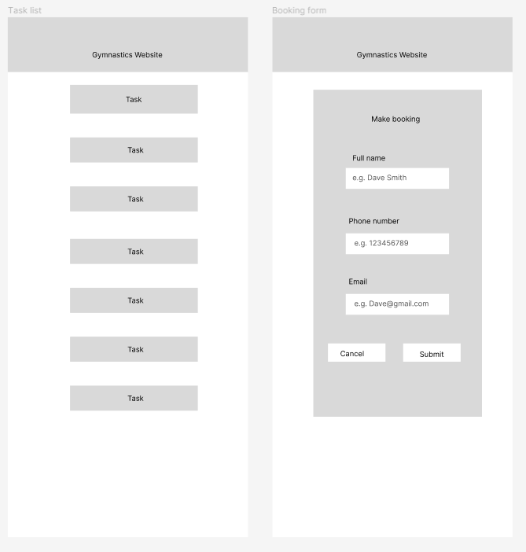

# Development of a Database-Linked Website for NCEA Level 2

Project Name: **PROJECT NAME HERE**

Project Author: **YOUR NAME HERE**

Assessment Standards: **91892** and **91893**

-------------------------------------------------

## Design, Development and Testing Log

### 16/05/2024

Designing the database

Today I designed the first database draft 

### 20/05/2024

Created UI flowchart

Today I made the first flowchart draft so i could see how the website would work

### 20/05/2024

Created first figma design

Today I drafted the first figma UI design so I could see how my website would look, and also get feedback from my client.

### 23/05/2024

I got feedback from my client and they said
>Instead of having the user input their surname and forename separately, it will be easier for them input at the same time. Add an option for the user to input their email because that is the way they will be contacted.

I responded to this feedback by removing the surname option and just having full name option. I also made sure the end-user can input their email as this will be the main form of contacting the end-user.

Since my client wanted the end-user to input their full name and email, I needed to change the database design

Today I added an option for the admin to login
### 27/05/2024

Replace this test with what you are working on

Replace this text with brief notes describing what you worked on, any decisions you made, any changes to designs, etc. Add screenshots / links to other media to illustrate your notes where necessary.

### DATE HERE

Replace this test with what you are working on

Replace this text with brief notes describing what you worked on, any decisions you made, any changes to designs, etc. Add screenshots / links to other media to illustrate your notes where necessary.