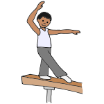

# 200DTD Assessment - Nelson Gymnastics task booking system

## Purpose

This project is a system that will allow a user to select a task at Gymnastics Nelson that needs to be done for an event.

## Features
- Allows the user to sign upo for a task.
- Allows users see what task they are doing and the date it is happening/needs to be done.
- Allows the admin to add and delete tasks.
- Allows the user to remove themselves from a task.
- Allows the user to see how many people are doing the task.
## Documentation

The following documents support this project:

- [Design & Review](Design.md)
- [Development & Testing](Development.md)

