# The Design of a Database-Linked Website for NCEA Level 2

Project Name: **Awesome Gymnastics Task Booking System**

Project Author: **Scott Noble**

Assessment Standards: **91892** and **91893**

-------------------------------------------------

## System Requirements

### Identified Need or Problem

Gymnastics Nelson needs a list of tasks that parents and gymnast's family members can select and sign up for volunteering at the Top of The South Gymnastics Competition with either food production or helping with the equipment. The admin at Gymnastics Nelson also need to track the people that sign up for a task.

### End-User Requirements

The clients of the business will be parents or family members of gymnasts who want to help out in Gymnastics Nelson competition at the Trafalgar Centre.

The clients want a way to see the list of tasks and when the task needs to be completed. They could do this via computer or mobile phone, but they might not be experienced using technology, so they system needs to be easy to use and requires little experience with technology.

### Proposed Solution

The proposed solution is having a website for Gymnastics Nelson that allows gymnastics coaches, parents, and gymnast's family members to view a list of tasks and sign up for them.

The website will also allow the organisers of the event to add or delete tasks.

Clients should be able to sign up for a task, and the admin can see who has signed up for each task and also delete or add a task if necessary.

-------------------------------------------------

## Relevant Implications

### Usability

The usability implications of a digital outcome relates to how easy it is for the end-user to use the website, without the need for help or guidance.

I will need to design my system to be as easy as possible to use because some of the parents of the gymnasts may not be as experienced in using technology as others. I will need to make sure my website is user friendly and can be used by everyone no matter what experience they have.

When I am designing my website's UI I will refer to Nielsen's heuristics, this is so my website can be easy to use. For my website I am going to aim for it to look simple and only show the necessary information. I will also aim to keep the UI consistent, as well as preventing the user from making errors.
To verify this I will test the UI with my users to get feedback which will allow me to improve on my design.

### Functionality

The functionality implications a digital outcome relates to how well it works for the end-user, in terms of meeting its intended purpose.

Functionality is relevant to my website because it is important to have a functional website so that users will not have a hard time using it and also so that no errors will happen when the website is being used.

When designing my website I will consider how functional it is by making sure it does everything it needs to do and meets the purpose of the website. I will also need to ensure that there are no bugs in the website, it does not crash, and works as intended from the users point of view.
To verify this I will test the functionality of the website with myself or with my users, I will use the feedback to improve on the functionality.

### Aesthetic

The aesthetic implications of a digital outcome will relate to how it good it looks in terms of the design.

Aesthetic is relevant to my website because it is important that it appeals to the users, and follows the design conventions.

When designing my website I will consider how aesthetic it looks by creating an overall design that is suitable for the websites purpose as well as making it look good and ensuring that it appeals to the users. To do this I will choose certain colours and fonts that work well together so it pleases the users. I will position and group elements together in a way that is balanced and focuses the users attention. I will use feedback to improve my design.

### End-user

The end-user implications of a digital outcome are connected to the specific needs of the end-users.

End-user is relevant to my website because I need to know who my end-users are and if it works on all devices that my end-users are likely to use.

When designing my website I will need to ensure that I know as much as I can about my end-users. I will need to use language that is appropriate to my end-users age. I will design it in a way that will work on the devices that my end-users are likely to use. I will use feedback to improve my design.

### Social

The social implications of a digital outcome involve how it affects users, the wider community and society as a whole.

The social implication is relevant to my website because I don't want to cause offence to anyone or stigmatise or stereotype particular social groups.

When designing my website I will avoid using racist or sexist language or images, as well as using gender neutral language where possible. I will also avoid promoting activities that have a negative impact on people / society (e.g. gambling, drinking, drugs, etc.). I will also make it suitable for all ages.

-------------------------------------------------

## Final System Design

### Database Structure

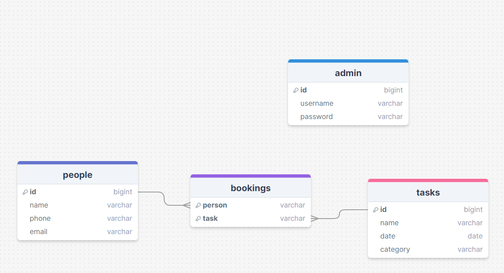

### User Interface Design

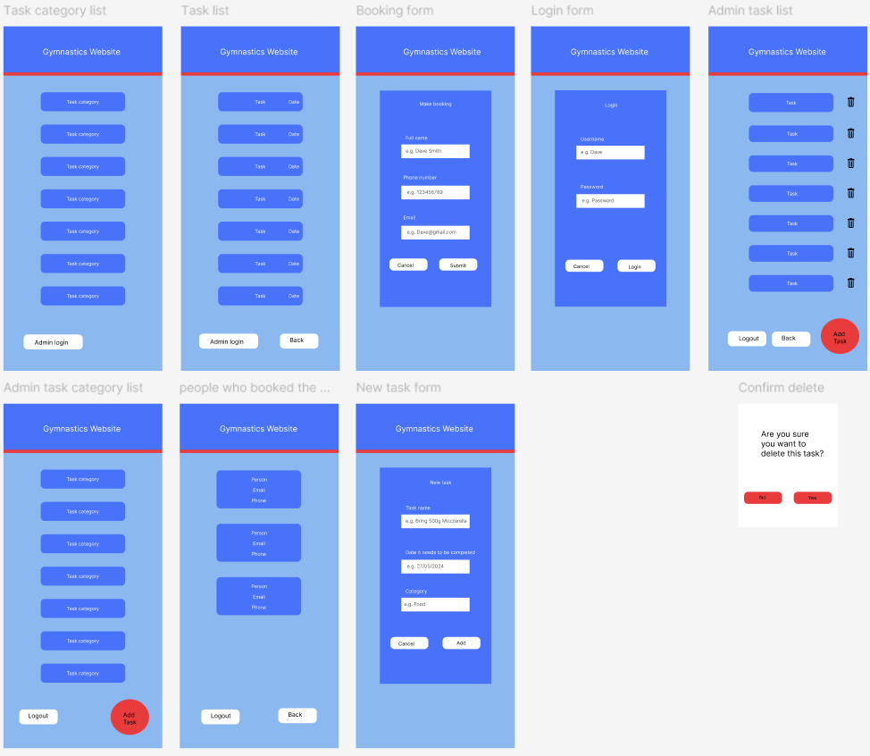

-------------------------------------------------

## Completed System

### Database Structure

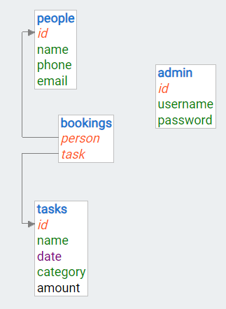
My final database structure is very similar to my design, however I have added an amount column into tasks table.

### User Interface Design
The category and task list items are closer together than the design, this is because if there is a lot of tasks the user will have to scroll longer since they are separated.
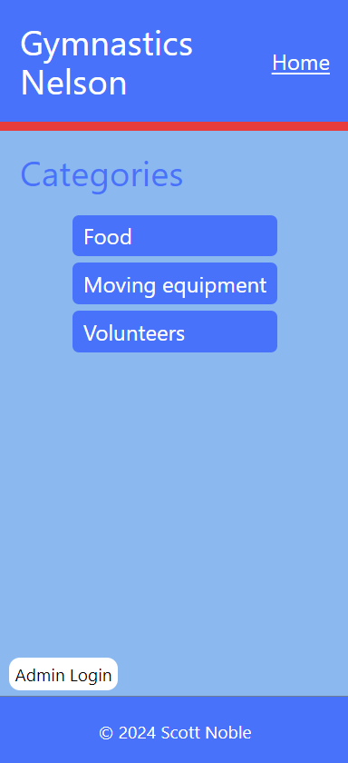

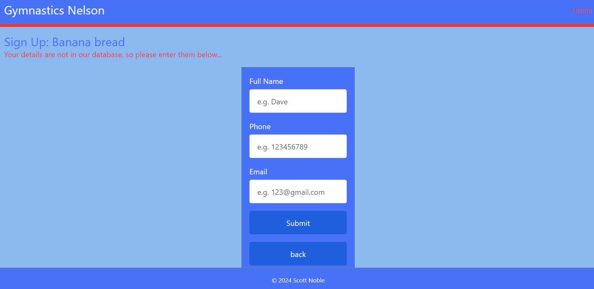

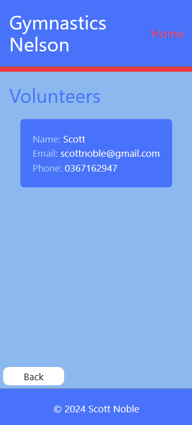

-------------------------------------------------

## Review and Evaluation

### Meeting the Needs of the Users

I have met the needs of the users by ensuring they can sign up for a task on a phone or computer, and making sure the website doesn't need a lot of experience using technology by having a title at the top of each screen showing what is being displayed. This is important because some of the gymnasts parents or grandparents might not be as experienced as others. Making sure the website does not require a lot of experience means that anyone can contribute and help out at the Gymnastics Nelson competition.

### Meeting the System Requirements

I met the system requirements by having a list of tasks so the user can sign up for a task. I added a feature where there is an amount of tasks available which decreases by 1 every time the user signs up. I have included an add and delete button so the admin can add and delete a task, as well as the admin being able to click on a task to see the people who have signed up for each task.

### Review of usability

I addressed the usability implication by using Nielsen's heuristics as stated below.

I showed visibility of system status by displaying a "thank you for signing up" message after the user signs up for a task so they know that they have signed up successfully.
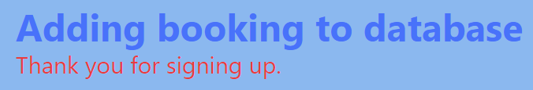

I showed match between system and the real world by using a rubbish bin to delete a task.
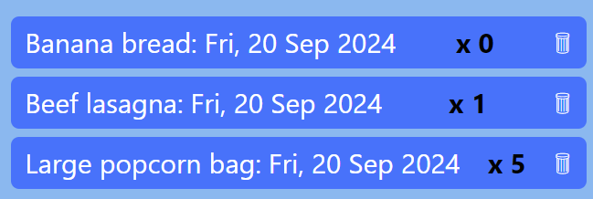

I showed user control and freedom by asking the user if they are sure they want to delete a task, and having an option to cancel.

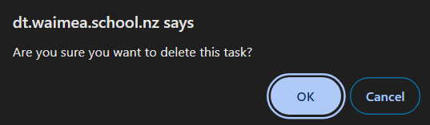

I showed consistency and standards by having the back button always in the same location. However in the form I chose not to have it in the same location but instead beneath the submit button. The reason for this was because I felt it was more user friendly to have the submit and back button the same section of the form.

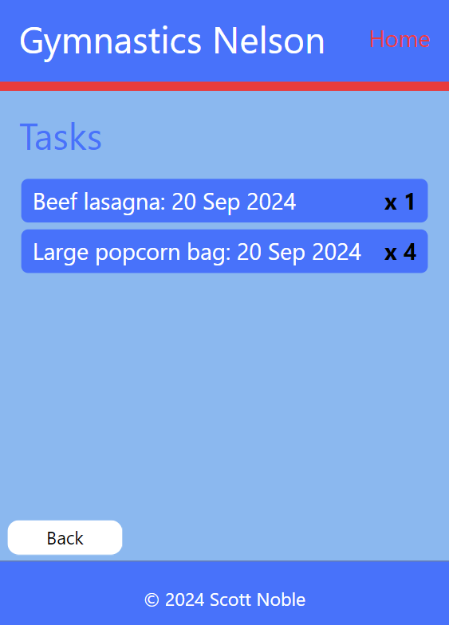

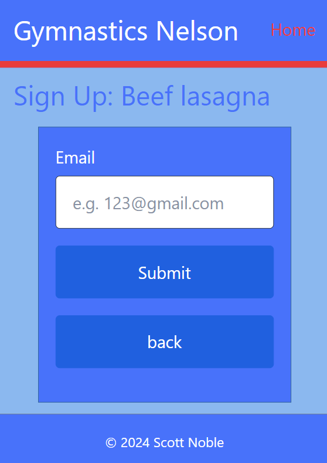

I showed error prevention by making all of the inputs in the form required, and ensuring that the the email the user has entered is valid. This stops the user from making an error when signing up for a task.

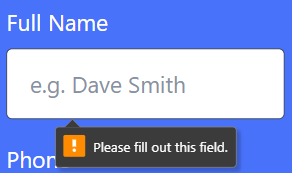

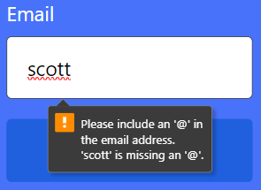

I showed recognition rather than recall by having a drop down menu when the admin is selecting a category for the task. This means that the admin does not need to remember the name of every category.

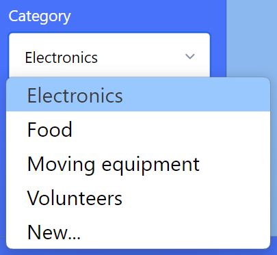

I showed flexibility and efficiency of use by having clear step-by-step actions for the user to sign up for tasks. I did this by having a list of categories that the user will select from which will take them to a list of tasks that they can sign up for.

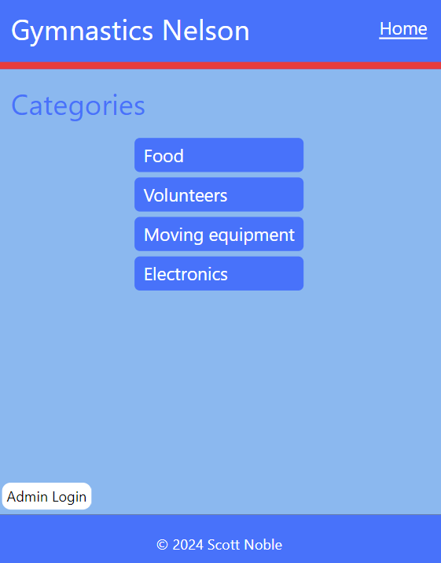

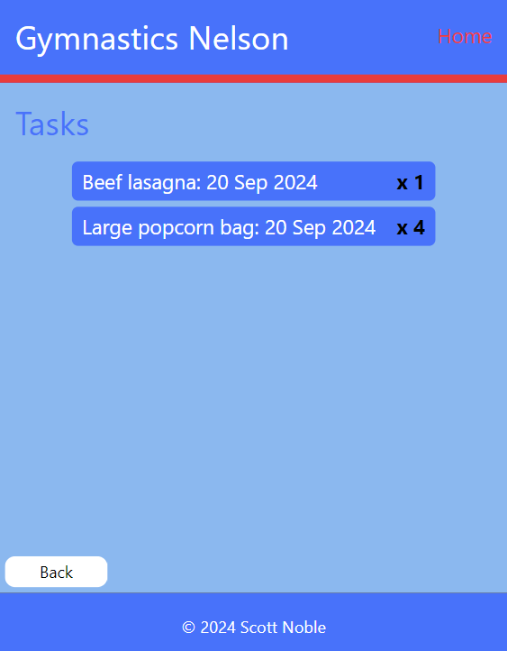

I demonstrated aesthetic and minimalist design by keeping my design as simple as possible so that the user would not overwhelmed by too much information. I did this by only showing necessary information on each page. I concentrated on keeping the design looking aesthetically pleasing so that the user did not get overwhelmed by the colours and/ or design of the website.

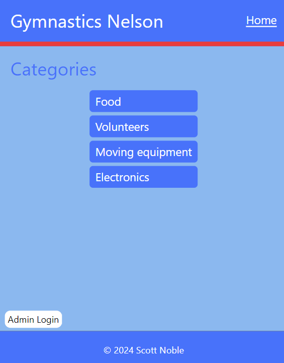

I showed the heuristic help users recognize, diagnose, and recover from errors by having a message that shows up if they have already signed up for a task. I made this message red so that the user will easily see it and know why the message was displayed. 

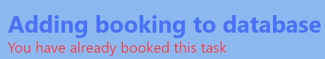

I did not feel that the heuristic help and documentation was needed as the website is simple to use and the users shouldn't need any help when using the website.

### Review of functionality

I addressed the functionality implication by making sure the website does everything it is supposed to do for example, the user signing up for a task, the task amount decreasing by 1 after every sign up, the admin being able to add and delete a task, as well as the admin being able to see who has signed up for each task. I have also ensured that there are no bugs in the website and does not crash. I did this by testing each input that the user can do on the website as well as letting my client test it. Doing this made sure that if there were any bugs I could know where it is and fix it easily.

### Review of aesthetic

I used the implication aesthetic by using fonts and colours that work well together and pleased the user. The font I used was sans serif which uses very simple letter formation which makes it easier to read. The colours I used were red, white, and varying shades of blue. These colours matched the Gymnastics Nelson logo. I chose to use white text on the darker blue background because it stands out and is easy to read. I tested this with my parents and brother to see if the colours were appealing and they said the colours were very nice and worked well together, and also did not hurt their eyes when they looked at it.

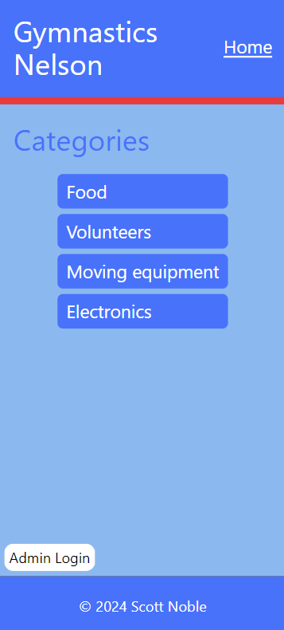

### Review of end-user

I addressed the end-user implication by finding out who my end-users are and by using language that could be easily understood by the end-user. For this website for Gymnastics Nelson my end-users are the parents, grandparents or adult family members of gymnasts. I also made sure that this website could be accessible and worked well on all devices that my end-users will be using. Even thought the main device my end-users will be using are phones, I made it work well on phones, laptops, and ipads/tablets.

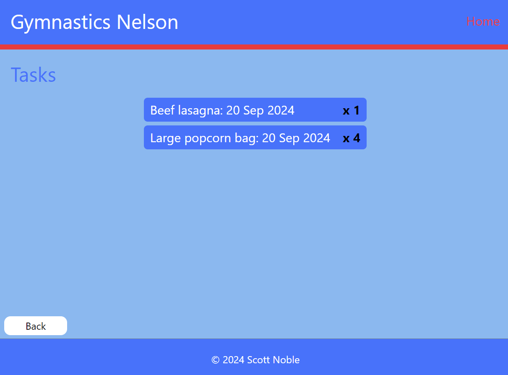
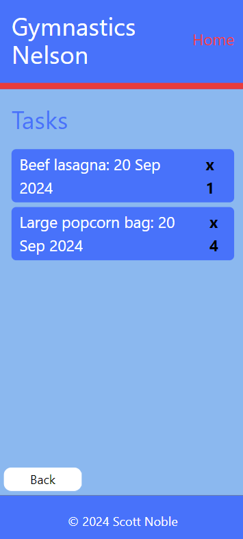

### Review of Social

I addressed the social implication by not using any racist or sexist language. The language that I choose to use was basic such as, admin login, add, back, submit. Therefore I did not use any bad language. This also means that it is suitable for all ages. On my website there was no opportunity to use gender neutral language. I also did not promote anything that will have a negative impact on society such as gambling, drinking, and drugs.
