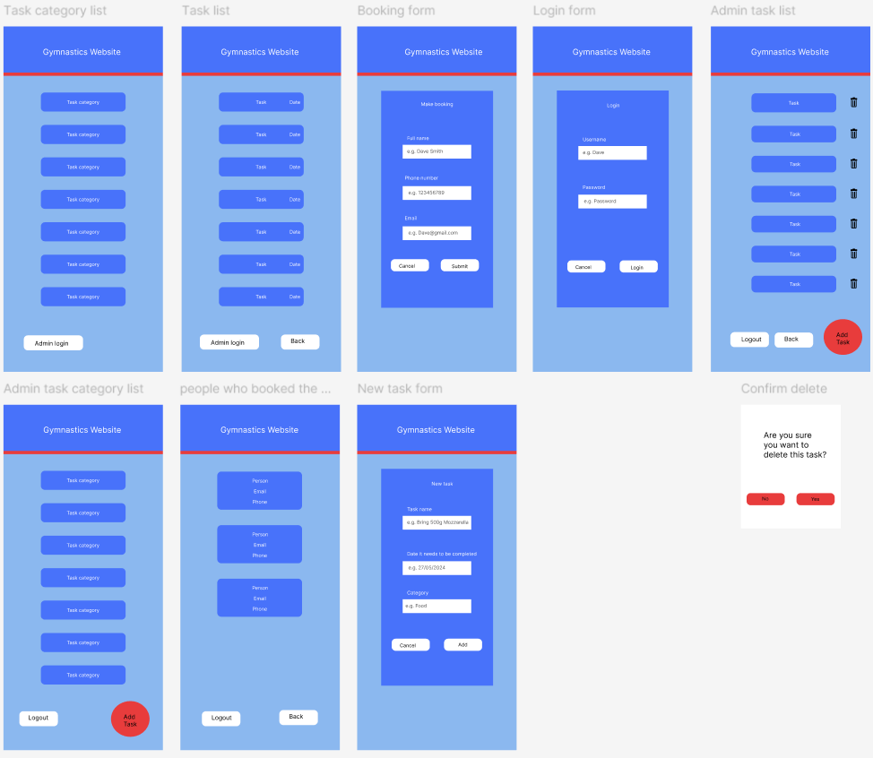

# Development of a Database-Linked Website for NCEA Level 2

Project Name: **PROJECT NAME HERE**

Project Author: **YOUR NAME HERE**

Assessment Standards: **91892** and **91893**

-------------------------------------------------

## Design, Development and Testing Log

### 16/05/2024

Designing the database

Today I designed the first database draft 

### 20/05/2024

Creating UI flowchart

Today I made the first flowchart draft so I could see how the website would work

### 20/05/2024

Creating first figma design

Today I drafted the first figma UI design so I could see how my website would look, and also get feedback from my client.

### 23/05/2024

I got feedback from my client and they said
>Instead of having the user input their surname and forename separately, it will be easier for them input at the same time. Add an option for the user to input their email because that is the way they will be contacted.

  
I responded to this feedback by removing the surname option and just having full name option. I also made sure the end-user can input their email as this will be the main form of contacting the end-user.

Since my client wanted the end-user to input their full name and email, I needed to change the database design

Today I added an option for the admin to login, but I couldn't finish the delete task button. I also added the date next to the task. Accidentally clicked on the top task button, not meant to have blue outline.

### 27/05/2024

Today I am finishing the admin log in page.

I finished the admin login page, finishing the delete task button and adding an add task button. I also made it so the admin can click on a task to see the people doing that task, as well as their contact information.

Today I have also changed the flowchart to show that the admin can view what people are doing the task.

### 30/05/2024

I got feedback from my client and they said
>When the admin is deleting a task instead of having the task confirmation on a new page, just have it on the same page. This is because it looks less confusing when it is kept on the same page.

I responded to this feedback by doing what they said and making the it overlap the page.

### 11/06/2024

I got more feedback from my client and they said
>It would be useful if there was a way to split the tasks into categories so it is easier for the admin to see the tasks that people have signed up for and what category it falls under. This will help if there are any gaps to target helpers in specific areas.

My client also said
>I felt that the login at the top of the page might be confusing for volunteers signing up for the tasks, as they might feel that they have to login.

I listened to my client and moved the login button to the bottom of the page and changed the name to admin login. I also made sure there was a category list to make it easier for the end-user to book a task that they want to do. I also made it so when the admin is adding a task they can choose a category that the task will go into.

I changed the database so that a task can belong to a category.

### 13/06/2024

My client said
>The design looks great and it is easy to use. The buttons might look nicer if they were slightly rounded but I think that this will work extremely well with the gymnastics families signing up for tasks needing completed for the gymnastics competition. I am very happy with the result.

I was pleased that my client was happy with the design and decided to slightly round the buttons so they didn't look as rectangular. I decided to leave the boxes in the forms when the user is inputing text. 

# 14/06/2024

My client and I discussed about what colours to use for the design.
My client said
>I would like the colours of the website to incorporate the samecolours as the Gymnastics Nelson logo which is blue, red and white. I feel that this would be important in retaining the Gymnastics Nelson identity.

We talked about where to put the colours and decided on this

My client also said
>I loved the red buttons on some of the pages however there isn't red on every page, it might be nice to have a thin strip of red under the title.

I responded to my clients feedback by putting a thin strip of red under the title. My client id happy with the final result.

#
I talked to my client before I started just to see if they had had any thought of any improvements that can be made to the website before I start the first draft and they said
>I think it will be a good idea to add a home button so the user wont have to click back multiple times to get back to the home page.

# 11/08/2024
I talked to my client and they said
>I have just realised that there is no limited amount of tasks available. This means 100 people can book the same task which is a problem if there is only 5 people needed.

I listened to my client and added a limit to how many tasks can be booked

I also needed to add an amount column to the database